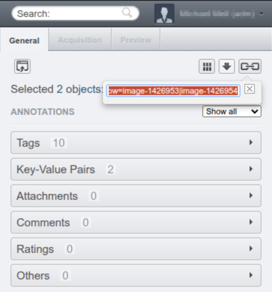

# A simple OMERO downloader GUI 🪄📥

`omero-downloader-gui` is a very basic GUI application that provides a
simplified workflow to download Images, Datasets or Projects from an OMERO
instance.

It was created in order to facilitate retrieval of files that were previously
imported into OMERO but are needed back in their original (file) format to open
them in tools that can not interface to OMERO directly or to transfer them to a
non-OMERO location.

## Benefits over exporting data through OMERO.web 🌐

While it's possible to download data using [OMERO.web][omero-web], there are
common problematic scenarios, e.g. if an object consists of multiple files (in
which case the server will attempt to create a `.zip` file before handing it
over to the client). For large datasets that can become an issue as (1) it puts
load onto the server and (2) it requires server-side (temporary) storage space
to create the container - which, depending on the setup, can lead to server
crashes 💣.

The `omero-downloader-gui` does not suffer from these issues and make
downloading easy (see usage instructions below).

## Benefits over exporting data through OMERO.insight

The main benefit of using OMERO Downloader over [OMERO.insight][omero-insight]
is simplicity. With OMERO Downloader the user simply copy-pastes the IDs or
links of selected objects from [OMERO.web][omero-web] into the Downloader and
presses the download button. This makes the process of _identifying_ 🕵️ and
_fetching_ 🚚 data straightforward and quick while the user workflow remains
centered on [OMERO.web][omero-web].

## Usage 📘

The `omero-downloader-gui` is able to consume URLs copied from OMERO.web
directly as well as OMERO identifiers like Dataset or Image IDs, making it very
convenient to using [OMERO.web][omero-web] for _identifying_ 🕵️ your data and
the Downloader for actually _fetching_ 🚚 it.

This is straightforward:

1. In OMERO.web, select the Projects, Datasets, or Images that you want to
   download and copy their URL:

   

1. Paste the URL into the OMERO Downloader and select the object type (Project,
   Dataset, or Image). Input target storage path, URL of the source OMERO server
   and user credentials:

   

1. Click button **Download all images**.

## Installation instructions

### Preferred: via `pixi global`

1. Get pixi as a temporary standalone executable or system-wide.
1. (_Optional_) Set `PIXI_HOME` to define where the installation should go to
   (for example on Linux: `export PIXI_HOME=/opt/omerodl` or on Windows:
   `${env:PIXI_HOME}="D:\OmeroDownloader"`).
1. Run `pixi global install` as outlined below to install the OMERO downloader.

```Powershell
pixi global install `
    --channel "https://prefix.dev/conda-forge" `
    --channel "https://prefix.dev/imcf" `
    omero-downloader-gui
```

#### Example 1: Windows 🟦 without prerequisites

The _PowerShell_ commands below will download the `pixi` executable to the
target path defined in the first line (can be adjusted) and then use it to
install the OMERO Downloader into that location (NOTE: Pixi is **not** required
after installation any more!). After completion, the downloader GUI can be found
at `C:\ProgramData\OmeroDownloader\bin\omero-downloader-gui.exe`.

```Powershell
$TargetPath = "C:\ProgramData\OmeroDownloader"
$PixiUri = "https://github.com/prefix-dev/pixi/releases/download/v0.67.2/pixi-x86_64-pc-windows-msvc.zip"
New-Item -ItemType Directory $TargetPath
Set-Location $TargetPath
Invoke-WebRequest -Uri $PixiUri -OutFile "pixi.zip"
tar xf pixi.zip
Remove-Item "pixi.zip"
${env:PIXI_HOME}=$TargetPath
.\pixi.exe global install `
    --channel "https://prefix.dev/conda-forge" `
    --channel "https://prefix.dev/imcf" `
    omero-downloader-gui
```

### Installing by cloning the repo and installing locally using `pixi`

When installing from the repository, it's also recommended to use [pixi],
although a classical Python `venv` setup is possible as well. In the latter case
make sure to use the ZeroC-Ice wheels provided by Glencoe ([Windows][ice-win],
[Linux][ice-linux]) in order to avoid the time-consuming compilation step.

Here, we're describing the setup using `pixi`:

1. First, you'll obviously need `pixi` itself. In case you don't have it yet,
   we're recommending to download the appropriate [standalone binary][pixi-bin]
   from GitHub as this won't involve any persistent changes to your system.
1. Next, clone this repository.
1. Copy the example configuration file `config-example.yml` to `config.yml` and
   adjust the contents to fit your needs.
1. Then, simply run `pixi install` inside the repo.

From there on, you may use `pixi` to launch the `omero-downloader-gui` tool, but
that's not a requirement. Calling it directly will also work, and is much
simpler:

```bash
# on 🐧 Linux:
$PATH_TO_REPO/.pixi/envs/default/bin/omero-downloader-gui
```

```Powershell
# on 🟦 Windows:
$PATH_TO_REPO\.pixi\envs\default\Scripts\omero-downloader-gui
```

### Desktop Shortcut

To create a Desktop Shortcut under Windows:

1. Right-click on the Desktop and select **New > Shortcut**.
1. Paste the path above (e.g.
   `C:\ProgramData\OmeroDownloader\bin\omero-downloader-gui.exe`)
1. Type in the name **OMERO Downloader**.
1. Confirm.

[pixi]: https://pixi.sh/
[pixi-bin]: https://github.com/prefix-dev/pixi/releases
[ice-linux]:
  https://github.com/glencoesoftware/zeroc-ice-py-linux-x86_64/releases
[ice-win]: https://github.com/glencoesoftware/zeroc-ice-py-win-x86_64/releases
[omero-insight]: https://github.com/ome/omero-insight
[omero-web]: https://github.com/ome/omero-web
